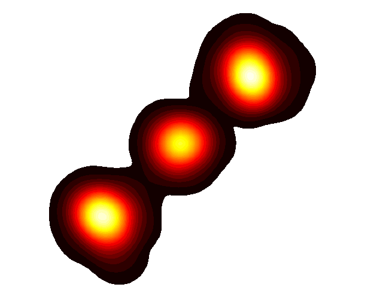
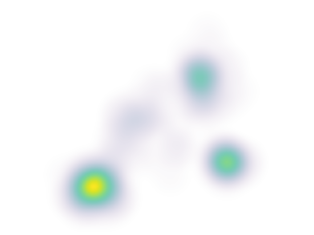

# Heatmap Generator

A professional Python toolkit for generating heatmaps over geographic maps and point cloud data using Kernel Density Estimation (KDE).



## Features

- **Kernel Density Estimation**: Generate smooth heatmaps using quartic kernel
- **Geographic Overlay**: Overlay heatmaps on custom map backgrounds
- **Animation Support**: Create animated heatmaps from temporal point cloud data
- **CLI Interface**: Easy-to-use command-line interface for all operations
- **Flexible Input**: Support for JSON coordinate files and NumPy arrays
- **Customizable**: Configurable grid size, bandwidth, color maps, and interpolation methods

## Visualization Examples

### Static Heatmap


*Example of heatmap visualization with clustered point cloud data using the viridis colormap*

### Animated Heatmap


*Real-time visualization of moving point cloud data with smooth heatmap transitions*

## Installation

### Prerequisites

- Python 3.8 or higher
- pip package manager

### Install Dependencies

```bash
pip install -r requirements.txt
```

### Install from Source

```bash
git clone https://github.com/dot-gabriel-ferrer/heatmap.git
cd heatmap
pip install -r requirements.txt
```

## Quick Start

### Command Line Interface

#### Generate a Heatmap from JSON Data

```bash
python cli.py generate --input coordinates.json --output heatmap.png
```

#### Create an Animated Heatmap

```bash
python cli.py animate --frames 200 --output animation.gif --background map.png
```

#### Overlay Heatmap on Background Image

```bash
python cli.py overlay --background map.png --heatmap heat.png --output result.png
```

#### Create GIF from Image Sequence

```bash
python cli.py gif --input "frames/frame*.png" --output animation.gif --duration 30
```

### Python API

```python
import numpy as np
from heatmap.heatmap_generator import create_heatmap_from_points

# Generate random point cloud data
x = np.random.rand(100) * 100
y = np.random.rand(100) * 100

# Create heatmap
create_heatmap_from_points(
    output_path='heatmap.png',
    x=x,
    y=y,
    grid_size=1.0,
    bandwidth=10.0
)
```

## Usage Examples

### 1. Basic Heatmap Generation

Create a heatmap from coordinate data stored in a JSON file:

```python
from heatmap.heatmap_generator import create_heatmap

create_heatmap(
    output_path='output.png',
    json_file='data.json',
    grid_size=1.0,
    bandwidth=10.0,
    colormap='jet'
)
```

**JSON Format:**
```json
[
    {"x": 10.5, "y": 20.3},
    {"x": 15.2, "y": 25.8},
    {"x": 12.1, "y": 22.5}
]
```

### 2. Animated Heatmap

Create an animated heatmap showing temporal changes:

```python
import numpy as np
from motion.motion import update_coordinates
from heatmap.heatmap_generator import create_heatmap_from_points
from animation.togif import create_gif

# Initialize point cloud
x = np.random.rand(100) * 100
y = np.random.rand(100) * 100

# Generate frames
for i in range(50):
    create_heatmap_from_points(f'frames/frame_{i:03d}.png', x, y)
    
    # Update positions
    x_delta = np.random.randn(100) * 2
    y_delta = np.random.randn(100) * 2
    x, y = update_coordinates(x, y, x_delta, y_delta)

# Create GIF
create_gif('frames/frame_*.png', 'animation.gif', duration=50)
```

### 3. Overlay on Geographic Map

Combine heatmap with a background map image:

```python
from animation.images import overlay_images

overlay_images(
    background_path='map.png',
    overlay_path='heatmap.png',
    output_path='composite.png',
    crop_box=(100, 100, 500, 500)  # Optional cropping
)
```

## API Reference

### heatmap.heatmap_generator

#### `create_heatmap(output_path, json_file, grid_size=1.0, bandwidth=10.0, colormap='jet', interpolation='gaussian')`

Generate heatmap from JSON coordinate file.

**Parameters:**
- `output_path` (str): Output file path for the heatmap image
- `json_file` (str): Path to JSON file containing coordinates
- `grid_size` (float): Size of grid cells for discretization
- `bandwidth` (float): KDE bandwidth parameter (higher = smoother)
- `colormap` (str): Matplotlib colormap name
- `interpolation` (str): Interpolation method ('gaussian', 'bilinear', etc.)

#### `create_heatmap_from_points(output_path, x, y, grid_size=10.0, bandwidth=10.0, colormap='jet', interpolation='gaussian')`

Generate heatmap from point cloud data.

**Parameters:**
- `output_path` (str): Output file path for the heatmap image
- `x` (array-like): X coordinates of points
- `y` (array-like): Y coordinates of points
- `grid_size` (float): Size of grid cells for discretization
- `bandwidth` (float): KDE bandwidth parameter
- `colormap` (str): Matplotlib colormap name
- `interpolation` (str): Interpolation method

### motion.motion

#### `update_coordinates(x, y, x_delta, y_delta)`

Update point cloud coordinates by adding delta values.

**Parameters:**
- `x` (array-like): Current X coordinates
- `y` (array-like): Current Y coordinates
- `x_delta` (array-like): Change in X coordinates
- `y_delta` (array-like): Change in Y coordinates

**Returns:** Tuple of (updated_x, updated_y)

### animation.images

#### `overlay_images(background_path, overlay_path, output_path, crop_box=None)`

Overlay a transparent image onto a background.

**Parameters:**
- `background_path` (str): Path to background image
- `overlay_path` (str): Path to overlay image (with transparency)
- `output_path` (str): Output path for composite image
- `crop_box` (tuple): Optional (left, top, right, bottom) crop coordinates

### animation.togif

#### `create_gif(input_pattern, output_path, duration=20, loop=0, quality=50, optimize=False)`

Create animated GIF from image sequence.

**Parameters:**
- `input_pattern` (str): Glob pattern for input images (e.g., "frames/*.png")
- `output_path` (str): Output path for GIF file
- `duration` (int): Frame duration in milliseconds
- `loop` (int): Number of loops (0 = infinite)
- `quality` (int): JPEG quality (1-100)
- `optimize` (bool): Enable palette optimization

## Configuration

### Kernel Density Estimation Parameters

- **Grid Size**: Controls the resolution of the heatmap. Smaller values create higher resolution but slower computation.
- **Bandwidth**: Controls the smoothness of the heatmap. Larger values create smoother heatmaps with wider influence radius.

### Color Maps

Available matplotlib colormaps include:
- `jet` (default): Rainbow color scale
- `hot`: Black-red-yellow-white
- `viridis`: Perceptually uniform blue-green-yellow
- `plasma`: Perceptually uniform purple-pink-yellow
- `coolwarm`: Blue-white-red diverging

## Project Structure

```
heatmap/
├── heatmap/           # Core heatmap generation module
│   ├── __init__.py
│   └── heatmap_generator.py
├── motion/            # Point cloud motion simulation
│   ├── __init__.py
│   └── motion.py
├── animation/         # Animation and image utilities
│   ├── __init__.py
│   ├── images.py      # Image overlay functions
│   └── togif.py       # GIF creation functions
├── utils/             # Utility functions
│   ├── __init__.py
│   └── image_utils.py
├── cli.py             # Command-line interface
├── simulation.py      # Example simulation script
├── requirements.txt   # Python dependencies
├── LICENSE            # MIT License
└── README.md          # This file
```

## Contributing

Contributions are welcome! Please follow these guidelines:

1. Fork the repository
2. Create a feature branch (`git checkout -b feature/amazing-feature`)
3. Commit your changes (`git commit -m 'Add amazing feature'`)
4. Push to the branch (`git push origin feature/amazing-feature`)
5. Open a Pull Request

## License

This project is licensed under the MIT License - see the [LICENSE](LICENSE) file for details.

## Acknowledgments

- Kernel Density Estimation implementation based on quartic kernel
- Uses Matplotlib for visualization
- Uses Pillow for image processing
- Uses NumPy for numerical computations

## Support

For issues, questions, or contributions, please open an issue on the [GitHub repository](https://github.com/dot-gabriel-ferrer/heatmap/issues).

